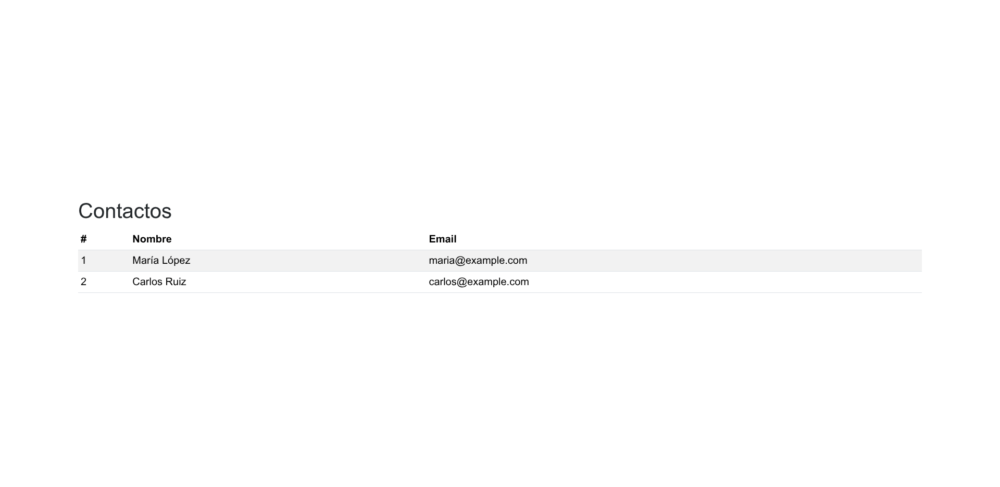

# Taller 3 - DDAW

Aplicación en Angular y Bootstrap que muestra una tabla de contactos con su ID, nombre y correo electrónico. Utiliza los componentes `ContactList` y `ContactRow` para presentar los datos.

## Ejecución

```bash
npm install
npm start
```

Abre http://localhost:4200/ en el navegador.

## Verificación

```bash
npm test -- --watch=false
npm run build
```

## Captura


