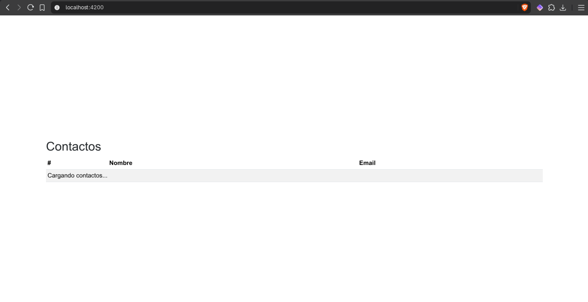
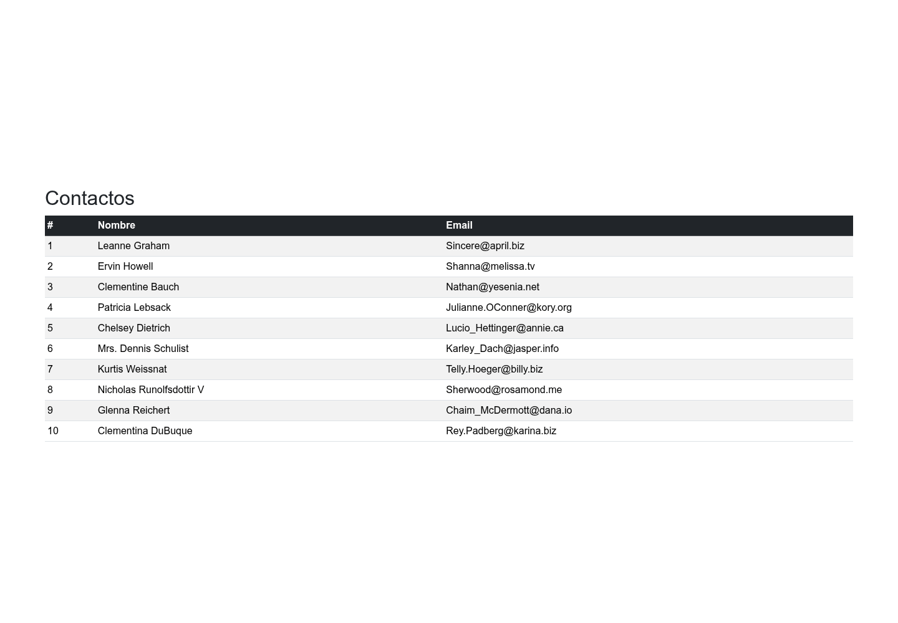
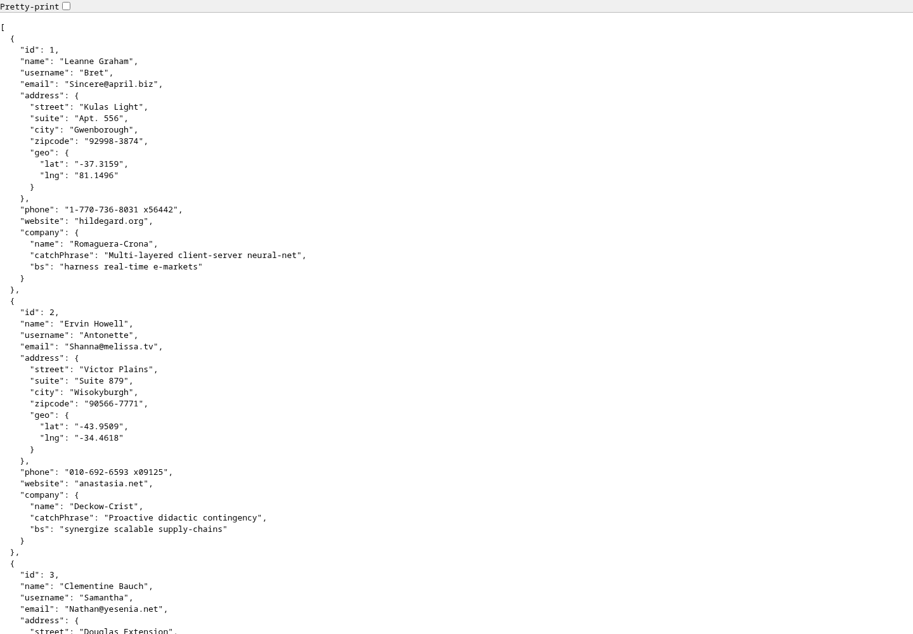

# Taller 4 · Consumo de una API

Aplicación de contactos desarrollada con **Angular y Bootstrap** para consultar datos de ejemplo de JSONPlaceholder y mostrarlos en una tabla con ID, nombre y correo electrónico.

> **Objetivo:** demostrar el recorrido de los datos desde una petición HTTP hasta su presentación en pantalla.

## Cómo funciona

`JSONPlaceholder → ContactsService → ContactList → ContactRow`

| Archivo | Responsabilidad |
| --- | --- |
| `src/app/app.config.ts` | Habilita `HttpClient` con `provideHttpClient()`. |
| `src/app/servicios/contacts.ts` | `ContactsService` consulta `GET https://jsonplaceholder.typicode.com/users`. |
| `src/app/components/contact-list/contact-list.ts` | Solicita los contactos al iniciar y guarda la respuesta en `contacts`. |
| `src/app/components/contact-list/contact-list.html` | Muestra el estado de carga y recorre los contactos. |
| `src/app/components/contact-row/contact-row.html` | Presenta el ID, nombre y correo de cada contacto. |

## Ejecución

```bash
npm install
npm start
```

Abre [localhost:4200](http://localhost:4200/) en el navegador. Se necesita conexión a Internet para consultar la API.

## Verificación

```bash
npm test -- --watch=false
npm run build -- --configuration development
```

Verificado en el navegador: la petición `GET /users` devuelve `200` y la tabla muestra los **10 contactos** de la respuesta, con el mismo ID, nombre y correo. El encabezado utiliza el fondo oscuro de Bootstrap.

Las 7 pruebas pasan y la compilación de desarrollo termina correctamente. Las pruebas del listado comprueban que la respuesta HTTP se muestre en filas y que el mensaje de carga desaparezca también cuando la petición falla.

## Capturas del taller 4

### 1. Estado de carga



*Captura inicial conservada.*

### 2. Contactos cargados desde la API



### 3. Datos de origen



La respuesta de [JSONPlaceholder](https://jsonplaceholder.typicode.com/users) contiene los datos mostrados en la tabla; por ejemplo, el contacto con ID `1` es `Leanne Graham`, con correo `Sincere@april.biz`.

<details>
<summary>Ver captura del taller 3</summary>


</details>
